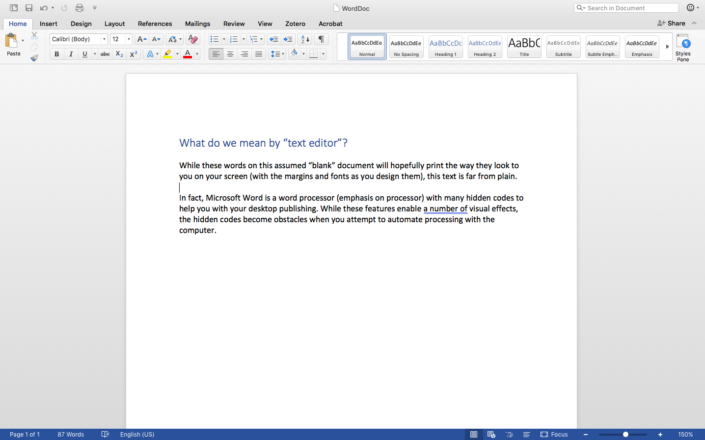

[<<< Previous](what-is-the-command-line.md) | [Next >>>](why-is-the-command-line-useful.md)

## Text Editors 

### What Is Text?

Before we explain which program we'll be using for editing text, we want to give a general sense of this "text" we keep mentioning. For those of us in the humanities, whether we follow literary theorists who read any object as a "text" or we dive into philology, paleography, codicology or any of the fields [David Greetham](https://en.wikipedia.org/wiki/David_Greetham_(textual_scholar)) lays out in *Textual Scholarship*, "text" has its specific meanings. As humanities scholars working with computers, we need to be aware of the ways plain text and formatted text differ. Words on a screen may have hidden formatting. Many of us grew up using Microsoft Word and don't realize how much is going on behind the words shown on the screen. For the purposes of communicating with the computer and for easier movement between different programs, we need to use text without hidden formatting.

If opened in a text editor, this Word .docx file will look something like this

if you ask the commandline to read that file. Word documents which look like "just words!" are actually comprised of an archive of extensible markup language (XML) instructions that only Microsoft Word can read. Plaintext files can be opened in a number of different editors and can be read within the command line.

## Text Editors

An important tool for programming and working in the command line is a text editor. A text editor is a program that allows you to edit plain text files, such as .txt, .csv, or .md. Text editors are not used to edit rich text documents, such as .docx or .rtf, and rich text editors should not be used to edit plain text files. This is because rich text editors will add many invisible special characters that will prevent programs from running and configuration files from being read correctly. 

While it doesn't really matter which text editor you choose, you should try to become comfortable with at least one text editor. 

### Default Recommendation

Choosing a text editor has as much to do with personality as it does with functionality. For our workshops, we will be using [Visual Studio Code](https://code.visualstudio.com/). Not only is Visual Studio Code free and open source, but it is also consistent across OSX, Windows, and Linux systems.

Take a moment to download now. We won't be using the editor a lot in this tutorial, so don't worry about getting to know the editor now. In later workshops we will discuss syntax highlighting and version control, which Visual Studio Code supports. For now we will get back to working in the command line itself.

[<<< Previous](what-is-the-command-line.md) | [Next >>>](why-is-the-command-line-useful.md)

[More information about text editors](text-editors-ides.md) can be found in the resources at the end of the lesson. 
