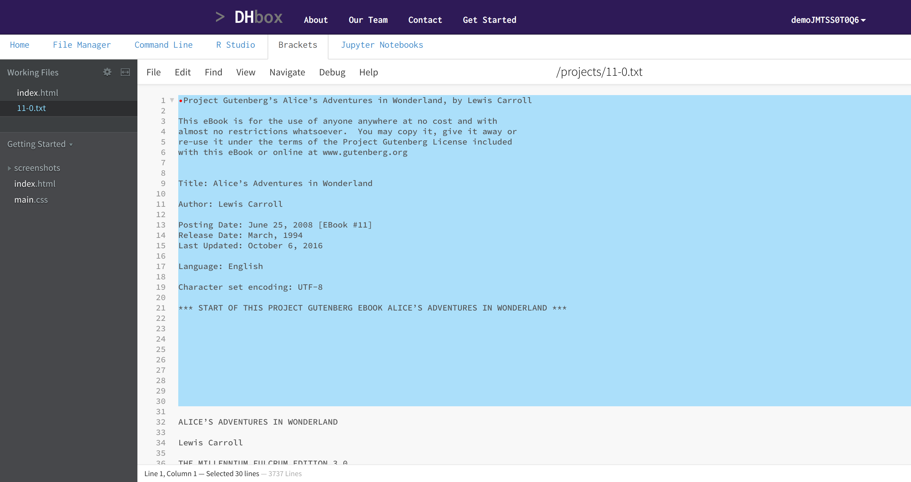
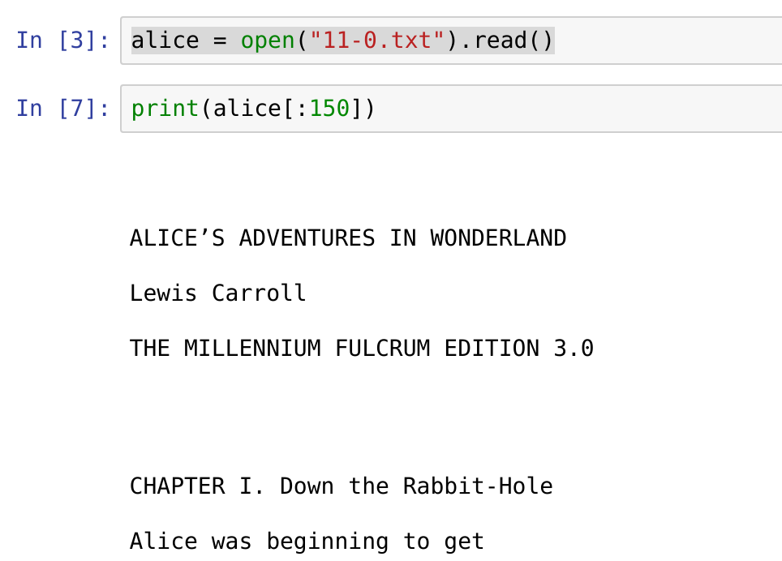
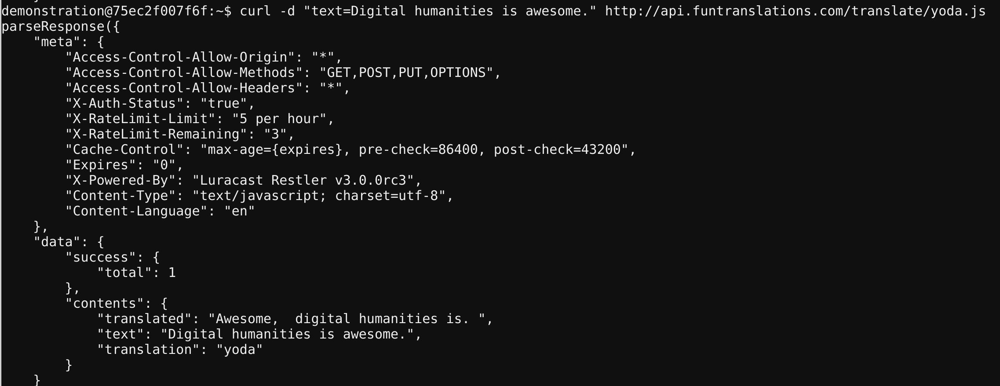

DH Box is a cloud computing platform for the digital humanities. _A_ DH Box is a single cloud computing workstation. This just means it's a computer that lives in the Internet, rather than on your laptop. Everything you can do on a DH Box you can also do on your own computer. But if you used your own computer, it might take a while to set up all the software just right. DH Box already has all the software you need, and it's all configured correctly. This allows you to get right to work, without spending hours installing and configuring software.

If you're using DH Box, chances are you're using it in the context of a digital humanities workshop. If that's the case, your workshop instructor will probably provide you with a username and password, which you can use to log in to the system. Use this username and password whenever you're prompted for them.

## Working with Files

You can get files in and out of a DH Box in a number of ways. Let's start by using the file manager. Download a plain text file (a file with the .txt) from the Internet. As an example, we can use the Project Gutenberg edition of Alice's Adventures in Wonderland, which you can get from [gutenberg.org/files/11/11-0.txt](http://www.gutenberg.org/files/11/11-0.txt). Go to that website, and save the file to your computer. This can usually be done by choosing "save as" from your web browser's File menu, or by right-clicking on the page and choosing "save page as." Now, in DH Box, go to your DH Box's File Manager tab, and click the "upload" button. Choose the file you just downloaded, which should be called 11-0.txt. Now you have a text file in your DH Box, saved to the `/home` directory. Let's do things with it. 

Go to the "command line" tab and log in using your username and password. Note that you won't see any text appear on the screen as you type in your password. 

First, see what directory you're in by typing the command `pwd` and pressing enter (`pwd` stands for "print working directory"). It should say something like `/home/username`, where "username" is your DH Box user name. Since I'm using the demonstration DH Box, for instance, I see `/home/demonstration`.

Since we saved our file to the `/home` directory, and not `/home/demonstration`, we'll have to change into to the `/home` directory to find our file. Type `cd /home` and press enter. (The command `cd` stands for "change directory.")

Now let's verify what directory we're in. Type the command `pwd` and press enter. You should see it display `/home`. Now we're in our `/home` directory, where we saved our text file. Let's see if the text file is there. Type `ls` and press enter. You should see it show the name of the file you just uploaded, `11-0.txt`, and the `demonstration` directory, or whatever your username is. 

Now we can do things with this text file. For example, let's get it to display the first few lines of the file. Type the command `head 11-0.txt`, and press enter. (From now on, I'm going to just say "run the command.")

There's a lot of Project Gutenberg license material there. We won't be needing that, so let's open a text editor and take it out. Go to the Brackets tab of your DH Box. Brackets is just a text editor program. There, in the File menu, choose "open." Select the file `11-0.txt`, and click the button "open." Now select all the text up to and including `*** START OF THIS PROJECT GUTENBERG EBOOK...` and delete it by pressing your backspace or delete key. You can also remove the license material from the end of the book in the same way. Save your changes by selecting "save" from the file menu. 

Now let's go back to the command line and try a few more things. Click the "command line" tab on your DH Box. How many words are in _Alice's Adventures in Wonderland_? To find out, run the command `wc -w 11-0.txt`. 

We can also work with our text file using Python. Click the "Jupyter Notebooks" tab on your DH Box. Click the "new" button and select "Python 3." You should now see a box labeled `In [ ]:`. Click in the box next to that colon. Let's verify what directory we're in here. Type `%pwd`, then press Shift + Enter (hold down Shift and press Enter or Return). It should say `/home`. 

Let's make sure our file is there. In a new cell, type `%ls` and press Shift+Enter. You should see our file, `11-0.txt` there.

 

Let's read in our file and do some things with it. In a new cell, enter the command `alice = open("11-0.txt").read()`, and run it using Shift+Enter. In a new cell, enter and run the command `print(alice[:150])`. This will print the first 150 characters of the book: 

Now you're ready to start analyzing the text! Fun digital humanities projects, here we come. For more on text analyses, see my tutorial
[text-analysis-tutorial.md](https://github.com/DH-Box/docs/blob/master/text-analysis-tutorial.md) in [the DH Box documentation repository](https://github.com/DH-Box/docs). 

## Fun with APIs

You can also access web APIs using your DH Box. As an example, let's try translating something into Yoda-speak. Log into your DH Box, then click the "command line" tab. Log in again there with your username and password. (Using the demonstration box, the username and password are both "demonstration.") 

Enter the command `curl -d "text=Digital humanities is awesome." http://api.funtranslations.com/translate/yoda.js` and press Enter. Be careful to enter that command exactly as written, or it won't work correctly. If your request worked, you'll see something like this: 

Look at the line `translated: ` and it should read: `Awesome, digital humanities is.`. 

Now let's do the same thing using Python. Click the "Jupyter Notebooks" tab, then click the "new" button, and select "Python 3." Enter the commands shown in the screenshots, pressing Shift-Enter to run them. First, import the `requests` library for making API requests, and the `json` library for parsing JSON: 

Next, request that your text be translated: 

Examine what the request returned: 

Now parse the JSON response using our JSON parser. (We're slicing the string between character 14 and the last two characters, so that we only get the text between the curly braces.)

Finally, we can access certain parts of our parsed object using Python slicing: 

## Further Resources

To learn more about the command line there are tons of introductory tutorials online. Just search for "command line tutorial" or visit one of these websites:

 - https://programminghistorian.org/lessons/intro-to-bash
 - https://tutorial.djangogirls.org/en/intro_to_command_line/

There are even interactive tutorials at sites like codecademy.com, which also has free interactive Python tutorials. To learn more about Python, try searching for "python tutorial" on YouTube, or visit one of these sites: 

- [Python lessons on Programming Historian](https://programminghistorian.org/en/lessons/?topic=python)
- [Introduction to Python](http://introtopython.org/)
- [Python resources on the GC Digital Fellows blog](https://digitalfellows.commons.gc.cuny.edu/2016/09/23/python-resources/)

[<<< Previous](WhatIsAPI.md) | [Next >>>](homework1.md)
